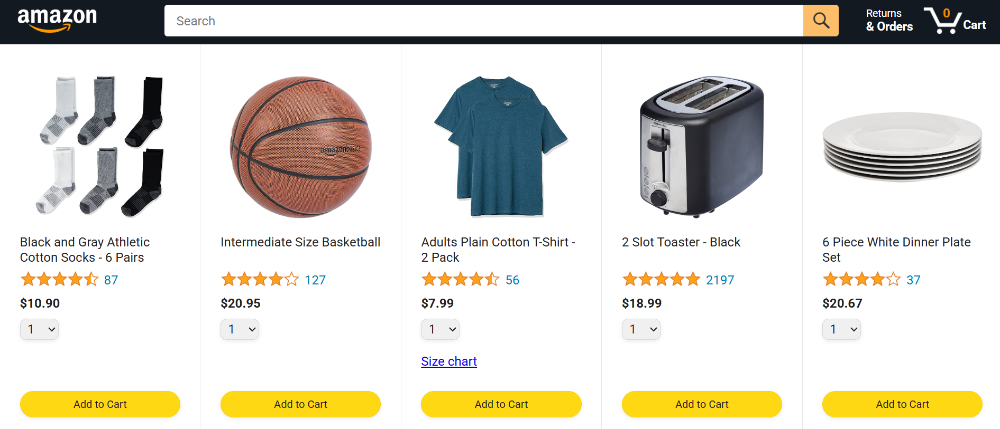

# 🛒 Amazon Clone

A functional **Amazon Clone** built using **HTML**, **CSS**, and **JavaScript**, powered by a **prebuilt backend API**. 

## 🔧 Features

- ✅ Product Listing with `fetch()` from FakeStore API
- 🛍️ Checkout Page that saves selected data
- 📦 Orders Page showing placed orders
- 🚚 Tracking Page for order tracking

## 🚀 How to Run

1. Clone the repository:

   ```bash
   git clone https://github.com/sandeep-m-patil/Amazon-E-Commerce.git
   cd amazon-clone

- 💅 Clean UI using prebuilt CSS styles
- ⚡ Modular JS code with separate files
- 🗂️ Fully responsive static frontend structure


## 📸 Preview

Here’s a quick look at the Amazon Clone UI:



### ✨ Screens Included
- index.html – Homepage with product listings

- checkout.html – Checkout page

- orders.html – Your orders summary

- tracking.html – Order tracking screen

